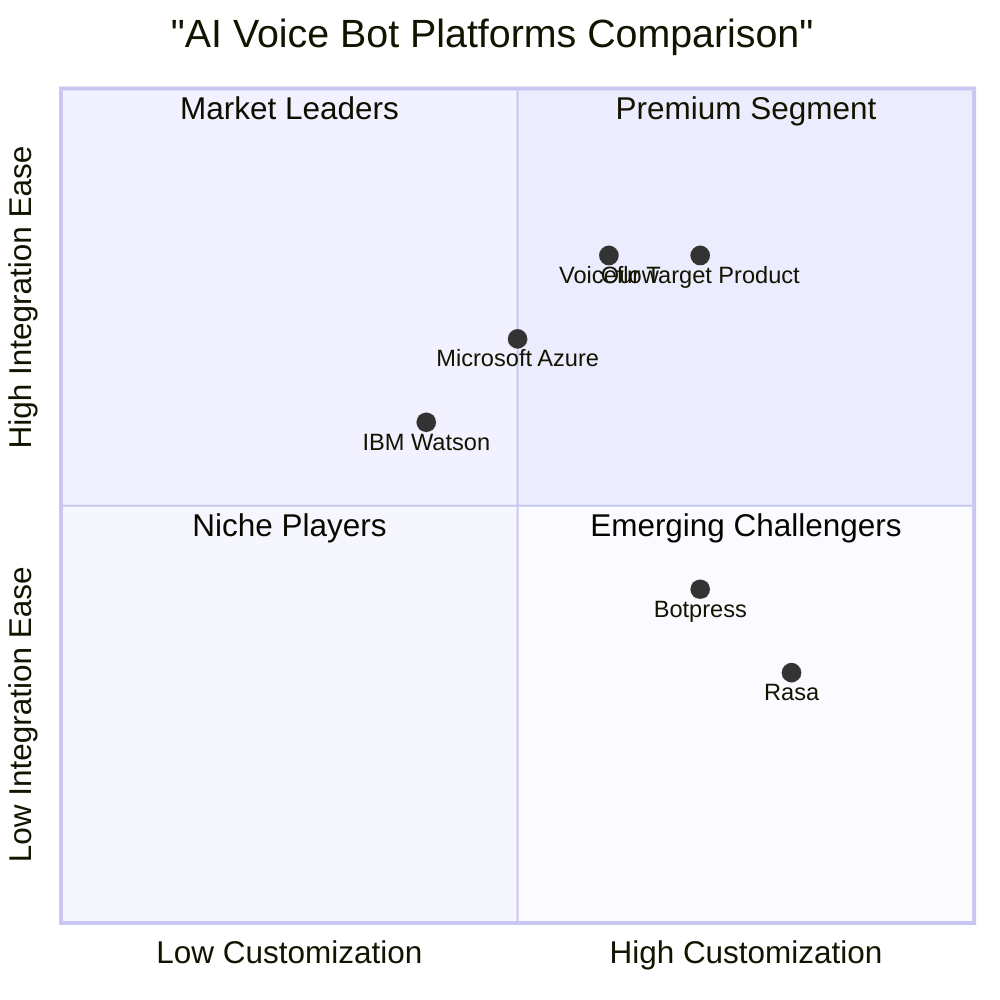
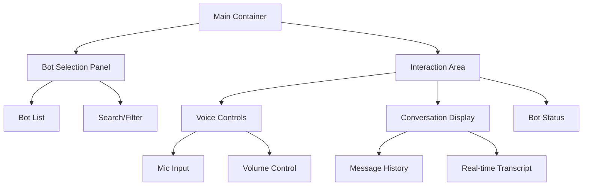

# AI Voice Bot Demo Application PRD

## Project Information
- Project Name: voice_bot_demo
- Date: 2025-03-15
- Original Requirements: Build an AI-powered voice bot demo application featuring multiple interactive AI agents that can be embedded into the existing website https://onmsai.com/

## 1. Product Definition

### 1.1 Product Goals
1. Create an engaging multi-agent voice bot platform that showcases various AI capabilities through interactive conversations
2. Provide seamless website integration through embeddable components while maintaining brand consistency
3. Deliver a scalable and reliable cloud-based solution for real-time voice interactions

### 1.2 User Stories
1. As a website visitor, I want to choose from multiple AI voice bots so that I can experience different AI capabilities and functionalities
2. As a website owner, I want to easily embed the voice bot demo into my existing website so that I can showcase AI services without major technical modifications
3. As a business owner, I want to customize the bot interface to match my brand identity so that it provides a cohesive user experience
4. As a potential client, I want to have real-time voice conversations with AI agents so that I can evaluate their capabilities before purchasing services

### 1.3 Competitive Analysis

#### Key Competitors:

1. Voiceflow
- Pros:
  * Comprehensive voice app design platform
  * Strong integration capabilities
  * Visual conversation builder
- Cons:
  * Complex for simple implementations
  * Higher pricing tier
  * Limited voice customization

2. Botpress
- Pros:
  * Open-source foundation
  * Flexible deployment options
  * Rich plugin ecosystem
- Cons:
  * Requires technical expertise
  * Voice features are limited
  * Self-hosting complexity

3. Rasa
- Pros:
  * Highly customizable
  * Strong NLU capabilities
  * Open-source core
- Cons:
  * Steep learning curve
  * Complex deployment
  * Limited voice features

4. Microsoft Azure Bot Service
- Pros:
  * Enterprise-grade security
  * Scalable infrastructure
  * Rich integration options
- Cons:
  * Higher cost
  * Complex setup
  * Platform lock-in

5. IBM Watson Assistant
- Pros:
  * Advanced AI capabilities
  * Enterprise support
  * Multi-language support
- Cons:
  * Expensive for small businesses
  * Complex integration
  * Limited customization

### 1.4 Competitive Positioning

## 2. Technical Specifications

### 2.1 Requirements Analysis

The voice bot demo application requires the following technical components:

1. Frontend Interface
- Responsive web interface
- WebRTC integration for voice handling
- Bot selection and interaction UI
- Real-time conversation display
- Voice input/output controls

2. Backend Services
- WebSocket server for real-time communication
- Voice-to-text and text-to-voice processing
- Bot management system
- API gateway

3. Integration Components
- Embed code generator
- iFrame implementation
- Cross-origin resource sharing (CORS) handling

4. Cloud Infrastructure
- Scalable cloud hosting
- CDN integration
- SSL/TLS security

### 2.2 Requirements Pool

#### P0 (Must Have)
- Multiple AI bot personalities with distinct functions
- Real-time voice interaction capabilities
- Embeddable interface generator
- Responsive design for all devices
- Basic UI customization options
- Cloud deployment with high availability

#### P1 (Should Have)
- Voice tone and accent customization
- Usage analytics dashboard
- Advanced UI theme customization
- Bot performance metrics
- Session recording capabilities

#### P2 (Nice to Have)
- Multi-language support
- Voice emotion detection
- A/B testing capabilities
- Custom wake words
- Voice bot marketplace

### 2.3 UI Design Draft

### 2.4 Open Questions

1. Technical Integration
- What are the specific technical limitations of the Hostinger AI builder platform?
- Are there any restrictions on external JavaScript execution?
- What are the performance implications of embedding the voice bot demo?

2. Security Considerations
- How will user data be handled and stored?
- What security measures are needed for voice data transmission?
- Are there specific compliance requirements for voice processing?

3. Scalability
- What is the expected concurrent user load?
- How will the system handle peak usage periods?
- What are the bandwidth requirements for voice streaming?

## 3. Implementation Timeline

1. Phase 1 (Weeks 1-2)
- Basic interface development
- Voice processing integration
- Single bot implementation

2. Phase 2 (Weeks 3-4)
- Multiple bot support
- Embedding functionality
- UI customization features

3. Phase 3 (Weeks 5-6)
- Cloud deployment
- Testing and optimization
- Documentation and launch

## 4. Success Metrics

1. Technical Metrics
- Voice recognition accuracy > 95%
- Response time < 1 second
- System uptime > 99.9%

2. User Experience Metrics
- User engagement time > 2 minutes
- Bot selection rate > 50%
- Successful voice interactions > 80%

3. Business Metrics
- Demo completion rate > 60%
- Embedding success rate > 90%
- User satisfaction score > 4.5/5

## 5. Risks and Mitigations

1. Technical Risks
- Browser compatibility issues
  * Mitigation: Comprehensive browser testing and fallback options
- Voice quality problems
  * Mitigation: Multiple voice processing providers and quality monitoring

2. User Experience Risks
- Complex interface learning curve
  * Mitigation: Interactive tutorials and clear UI guidance
- Voice interaction failures
  * Mitigation: Text fallback options and error handling

3. Integration Risks
- Website conflicts
  * Mitigation: Isolated iframe implementation and conflict detection
- Performance impact
  * Mitigation: Lazy loading and optimization techniques