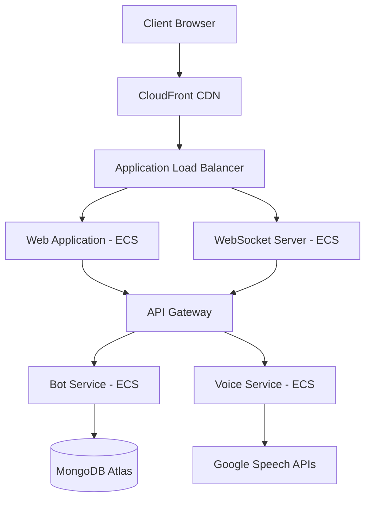

# Voice Bot Demo System Design

## Implementation Approach

### Technology Stack
- Frontend: React + Tailwind CSS for UI, WebRTC for voice streaming
- Backend: Node.js with Express, WebSocket for real-time communication
- Voice Processing: Google Speech-to-Text and Text-to-Speech APIs
- Database: MongoDB for bot data and configurations
- Cloud Infrastructure: AWS (ECS for containerization, CloudFront for CDN)
- Embedding: iFrame with postMessage API for cross-origin communication

### Key Technical Solutions
1. Voice Processing
   - WebRTC for capturing voice input with low latency
   - Server-side audio streaming for real-time transcription
   - Client-side audio buffering to handle network instability

2. Bot Management
   - Microservices architecture for independent bot services
   - Dynamic bot loading for scalability
   - Shared NLP pipeline with bot-specific training models

3. Embedding Solution
   - Secure iFrame implementation with configurable permissions
   - PostMessage API for parent-frame communication
   - Dynamic resize handling for responsive layout

4. Performance Optimization
   - Lazy loading of bot models and assets
   - Edge caching for static resources
   - WebSocket connection pooling

### Infrastructure Design

## Data Structures and Interfaces
[See voice_bot_demo_class_diagram.mermaid]

## Program Call Flow
[See voice_bot_demo_sequence_diagram.mermaid]

## Security Considerations
1. Data Protection
   - End-to-end encryption for voice data transmission
   - Secure WebSocket connections with JWT authentication
   - Rate limiting and request validation

2. Embedding Security
   - Domain whitelist for iframe embedding
   - Content Security Policy (CSP) implementation
   - CORS configuration for API access

## Scalability Strategy
1. Horizontal Scaling
   - Auto-scaling ECS tasks based on load
   - Read replicas for MongoDB
   - WebSocket connection distribution

2. Performance Optimization
   - CDN caching for static assets
   - Voice data compression
   - Lazy loading of bot models

## Monitoring and Analytics
1. Technical Metrics
   - Voice recognition accuracy tracking
   - Response time monitoring
   - System uptime and error rates

2. Business Metrics
   - User engagement tracking
   - Bot usage statistics
   - Conversion analytics

## Anything UNCLEAR
1. Integration Specifics
   - Detailed Hostinger AI builder platform capabilities and limitations
   - Available JavaScript APIs and restrictions
   - Custom code injection possibilities

2. Performance Requirements
   - Expected concurrent user count
   - Maximum allowed response time
   - Voice quality requirements

3. Compliance Requirements
   - Voice data retention policies
   - Required security certifications
   - Regional data storage requirements